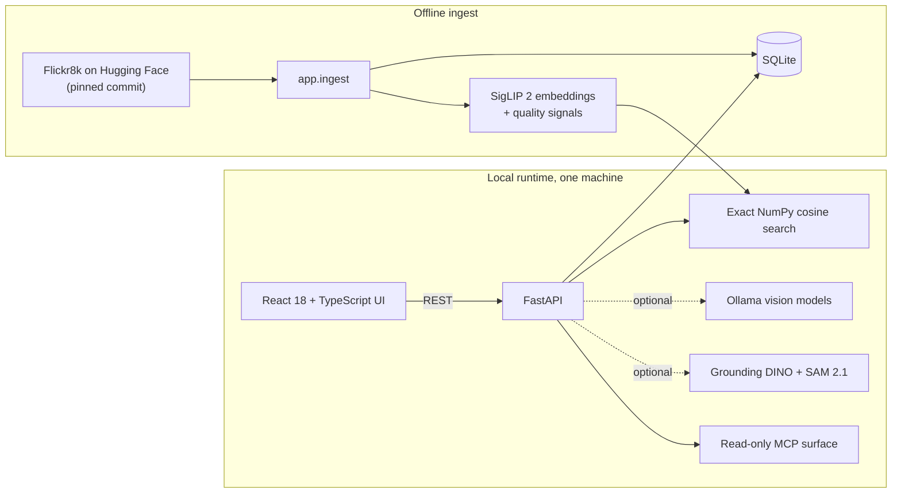

# CV Dataset Explorer

[](https://github.com/aimanyounises1/cv-dataset-explorer/actions/workflows/ci.yml)
[](LICENSE)
[](backend/requirements.txt)
[](frontend/package.json)
[](backend/pyproject.toml)

A local workspace for exploring, auditing, comparing, and curating the
[Flickr8k](https://huggingface.co/datasets/jxie/flickr8k) image-caption dataset.
It is built for computer vision researchers who need to understand a dataset,
not just browse files.

Everything runs on one developer machine. The application uses React,
FastAPI, SQLite, local embedding models, and optional local vision models. It
does not require a cloud service, hosted search, external vector database, or
paid API.


## Run locally

### Requirements

- Python 3.11+
- Node.js 20+
- Enough disk space for Flickr8k and the SigLIP 2 model

### 1. Start the backend

From the repository root:

```bash
cd backend
python3 -m venv .venv
source .venv/bin/activate
python -m pip install -r requirements.txt

# Downloads Flickr8k, builds the SQLite database, computes embeddings,
# and creates the analysis artifacts used by the UI.
python -m app.ingest

python -m uvicorn app.main:app --port 8000
```

The first ingest downloads the dataset and model weights, so its duration
depends on the machine and network. It is safe to run again. For a lighter
keyword-only setup, use `python -m app.ingest --skip-embeddings`.

On Windows, activate the environment with
`.\.venv\Scripts\Activate.ps1` and use `python` instead of `python3`.

### 2. Start the frontend

In a second terminal:

```bash
cd frontend
npm ci
npm run dev -- --port 5173
```

Open [http://localhost:5173](http://localhost:5173).
The API is available at [http://localhost:8000/docs](http://localhost:8000/docs).

After the first setup, macOS users can also launch both processes with
`./start.command`.

### Docker

The host setup above is recommended when using Apple MPS or CUDA. A CPU-only
container path is also available:

```bash
docker compose build
docker compose run --rm backend python -m app.ingest
docker compose up
```

Then open [http://localhost:5173](http://localhost:5173). Application data is
stored under `backend/data/` in both workflows.

## What the application does

| Workflow | Why it is useful |
| --- | --- |
| Browse and search | Find images with keyword, semantic, hybrid, or image-based search. Filters and reference images help isolate long-tail slices. |
| Inspect one sample | Review the source image, five captions, metadata, quality signals, nearest neighbours, and search provenance in one place. |
| Audit the dataset | Explore the embedding map, caption consistency, difficulty axes, split leakage, near-duplicates, and retrieval quality. |
| Detect and segment | Ground an open-vocabulary phrase with Grounding DINO, refine it with SAM 2.1, and require human review before saving a mask. |
| Compare two frames | Use synchronized zoom, corruption checks, stored signals, and an optional local semantic-difference proposal. |
| Curate and export | Save ordered albums and export slices, accepted masks, transparent cutouts, and provenance manifests. |


Model output is always presented as a proposal. A VLM result never becomes a
caption or label automatically, and a detector or segmentation result is not
stored until a reviewer accepts it.


## Reading a result set

A search returns a ranking, not an answer, so the gallery is built for
interrogating one.

**Modes.** Keyword search is FTS5 BM25 over the captions, semantic search
encodes the query with SigLIP 2 and compares it to the image embeddings, and
hybrid fuses the two by reciprocal rank. You can also search by image, by a
region drawn on an image, or by example, using pictures already in the corpus
as positive and negative references. Scores from different modes are not
comparable — a cosine and a fused rank sum are different quantities — so every
response names its own basis and the interface prints that name next to the
number rather than showing a bare score.

**Search settings** holds the three controls that change how a ranking is
produced or presented: the mode, the order, and the tile size. Order is either
relevance or one of the four difficulty axes in either direction, such as
"Difficulty — hardest first". Sorting is applied to the whole matching set in
SQL before paging, so it returns the hardest samples in the selection rather
than the hardest ones on the current page.


**Filters** live in the left rail and narrow the corpus *before* ranking, never
after: the split, the zero-shot attribute facets, your own tags, a range on any
difficulty axis, and a pasted list of ids or filenames for bringing a set back
from somewhere else. Several filters intersect, the active ones appear as
removable chips above the results, and all of them live in the URL — so a
selection is a link you can hand to someone else, and the export button hands
back exactly the set on screen.

**The frame edge** answers a different question: not *which* samples match, but
*which of them are hard*. Pick an axis from the dropdown above the grid and
every tile gets a bar down its left edge, tall where the score is high, so you
can scan a page of results and see where the difficult samples are without
opening any of them. It is an overlay and nothing more — it re-ranks nothing,
filters nothing, and changes no link. Use the order control when you want the
set itself to change.


**The score distribution** above the grid plots the visible results, and the
"dim below" handle greys out everything under a chosen score. That is also a
view rather than a filter: the dimmed cards stay in the set and in the export,
because a threshold you are still choosing should not silently delete data.

## Data provenance

The corpus is the [`jxie/flickr8k`](https://huggingface.co/datasets/jxie/flickr8k)
copy of Flickr8k on Hugging Face. `backend/app/datasets/flickr8k.py` pins the
full Hub commit `56f58c967835f7c508d684f36bd7897cca9d7634` rather than `main`,
so a fresh ingest sees the same files and the same splits as the run being
reviewed. Images and thumbnails are written under `backend/data/`, which is
gitignored: this repository redistributes nothing.

The application reports the same provenance against your own ingest, with live
counts, under **Dataset profile → Provenance** (`/stats?view=provenance`). A
dataset tool that hides its own provenance is asking to be trusted on faith, so
the known caveats are recorded in both places.

- **Source.** The dataset card for this copy carries no construction methodology
  and specifies no license.
- **Row count.** 8,000 images (6,000 / 1,000 / 1,000 across train / validation /
  test), against about 8,091 in the original Flickr8k distribution. Roughly 90
  images are absent, with no explanation given upstream.
- **Splits.** The counts match the canonical Hodosh split, but the per-image
  assignments are undocumented in this copy and have not been verified against
  the original split files.
- **Captions.** Five per image, written by crowdworkers. The adapter detects
  caption columns by prefix, so a minor upstream schema change does not stop
  ingestion.
- **Licensing.** Upstream Flickr8k is for non-commercial research and education
  only. This copy states no license of its own, so the upstream terms are the
  safe assumption, and an exported slice inherits them rather than this
  repository's.
- **Composition.** Captions were written by US-based crowdworkers and the images
  came from a handful of Flickr hobby groups, so the corpus is not a neutral
  sample of the visual world: expect people, dogs, and outdoor action to
  dominate.

## Optional local models

The core gallery, search, sample inspection, map, audits, albums, and exports
work after the normal ingest. The following features are optional and explain
their setup in the UI when unavailable.

### Vision inspection

Install [Ollama](https://ollama.com), then pull one or both configured vision
models:

```bash
ollama pull gemma4:12b
ollama pull qwen3.5:9b
```

Single-image inspection accepts an explicitly configured local model. Semantic
pair comparison is stricter: it is enabled only when the configured Qwen
artifact and Ollama runtime match the locally validated contract.

### Detection and segmentation

The request path never downloads model weights. Fetch the pinned snapshots
explicitly from the activated backend environment:

```bash
python -c "from huggingface_hub import snapshot_download; snapshot_download(repo_id='IDEA-Research/grounding-dino-tiny', revision='a2bb814dd30d776dcf7e30523b00659f4f141c71')"
python -c "from huggingface_hub import snapshot_download; snapshot_download(repo_id='facebook/sam2.1-hiera-tiny', revision='de431c4043854a71d8101e17995dfe596bf101a5')"
```

A detector query is free text: one phrase, or several separated by periods
(`a person. a dog.`). The backend normalizes input to the detector's own
candidate-label format, so `dog` and `a dog.` describe the same query.

### LangChain/LangGraph assistant

The assistant remains available as an optional, experimental interface over
the same local search and inspection services:

```bash
cd backend
source .venv/bin/activate
python -m pip install -r requirements-agent.txt
ollama pull qwen3:8b
```

Its LangGraph execution trace is streamed into the chat UI. Read operations
use the same service layer as the REST API, and any proposed write still
requires explicit browser approval. The main CV workflows do not depend on
the assistant.


A strictly read-only local MCP surface is also exposed at `POST /mcp`.

## Design choices

- **SQLite and exact NumPy search fit this dataset.** With 8,000 images, an
  external vector database would add operational complexity without improving
  the main request path.
- **SigLIP 2 is the default retrieval model because it performed better in the
  built-in Flickr8k retrieval benchmark.** Qwen3-VL retrieval remains an
  optional provider behind the same interface.
- **Analysis is separated from interaction.** Ingest-time work computes
  embeddings, projections, quality signals, and attributes; normal search
  requests perform database reads and at most one query encoding.
- **Optional capabilities degrade clearly.** Missing model weights disable
  only the related feature and return a setup reason instead of failing the
  application.
- **Human review is the write boundary.** Vision models may suggest classes,
  boxes, masks, captions, or differences, but they do not silently change the
  dataset.

## Architecture

```text
frontend/src/          React 18 + TypeScript + Vite
backend/app/datasets/  dataset adapters and the pinned Flickr8k source
backend/app/api/       FastAPI routes and the read-only MCP surface
backend/app/ml/        embeddings, retrieval, detection, and segmentation
backend/app/agent/     optional LangChain/LangGraph assistant
backend/app/qa/        browser workflow registry and QA runner
backend/data/          generated local database, images, indexes, and reports
scripts/               benchmarks, validation, link checks, and UI smoke tests
```

The same shape, as a request-flow diagram:




Search state lives in the URL, so an investigation can be shared as a link.
The gallery, exports, REST API, MCP tools, and assistant all reuse the same
ranking service rather than implementing competing search logic.

Configuration is controlled with environment variables. See
[.env.example](.env.example) for every supported setting and its default.

## Verification

```bash
# Backend lint (ruff is not in requirements.txt: pip install ruff)
cd backend
.venv/bin/ruff check app tests

# Backend tests
.venv/bin/python -m pytest -q

# Frontend
cd ../frontend
npm run build

# Repository links
cd ..
backend/.venv/bin/python scripts/check_links.py
```

Optional end-to-end browser verification requires Chrome and
`backend/requirements-qa.txt`:

```bash
cd backend
.venv/bin/python -m pip install -r requirements-qa.txt
.venv/bin/python ../scripts/ui_smoke.py
```

CI runs backend lint and tests, the TypeScript production build, and the
relative-link check. Model inference and the full browser sweep are local
verification steps because CI does not download the dataset or model weights.

## Current limitations

- This is a local, single-user tool with no authentication. Do not expose the
  API directly to a network.
- Exact cosine search is a deliberate choice for 8,000 images; a substantially
  larger dataset would need a measured ANN or vector-index migration.
- Optional local models require additional disk, memory, and setup. Their
  outputs remain proposals rather than ground truth.
- The assistant is experimental and is not required for the verified dataset
  exploration workflow.
- Docker inference is CPU-only and slower than the accelerated host path.
- Flickr8k here is one Hugging Face copy: it states no licence of its own and is
  missing about 90 of the original images. The upstream terms (non-commercial
  research and education) are the safe assumption, an exported slice inherits
  them, and this repository redistributes nothing. See
  [Data provenance](#data-provenance).
