# CV Dataset Explorer

**A local workspace for finding, auditing and curating slices of an
image–caption dataset — the 8,000 images and 40,000 human captions of
[Flickr8k](https://huggingface.co/datasets/jxie/flickr8k) — where every
ranking, score and measurement is labelled with what produced it.**

Working with a dataset means answering questions a file browser cannot: where
are the night scenes, which captions their own image does not support, which
300 samples are hardest, whether the held-out split is contaminated by
near-duplicates of training images. The through-line is **long-tail
discovery** — rare scenes, coverage gaps, and the annotations that don't hold
up are what the rarity axis, the coverage dashboard, the similarity floor and
the caption audit exist to surface. Everything runs on one machine: SQLite for
storage, local embedding models for retrieval, no cloud services, no paid
APIs, no external vector database.

## Quick start

```bash
# backend (Python 3.11+)
cd backend
python -m venv .venv && source .venv/bin/activate
pip install -r requirements.txt
python -m app.ingest            # downloads Flickr8k + SigLIP 2, builds everything (~20 min)
uvicorn app.main:app --port 8000

# frontend (Node 20+), second terminal
cd frontend && npm install && npx vite --port 5173
```

Open http://localhost:5173. `python -m app.ingest --skip-embeddings` skips the
model download and runs keyword-only; every ML capability is an optional layer
that reports its own availability and names the command that enables it.

Optional layers, each honest about its absence:

| Layer | Enable with |
|---|---|
| Assistant (local agents) | [Ollama](https://ollama.com) + `ollama pull qwen3:8b`, then `pip install -r requirements-agent.txt` |
| VLM tag enrichment | `ollama pull qwen2.5vl:7b`, then `python -m app.enrich` |
| Self-QA browser sweep | `pip install -r requirements-qa.txt` (Playwright + real Chrome) |
| Qwen3-VL retrieval provider | `pip install -r requirements-qwen.txt`, then `python -m app.ingest --provider qwen3_vl` |
| Region suggestions (zero-shot detector) | `python -c "from huggingface_hub import snapshot_download; snapshot_download('IDEA-Research/grounding-dino-tiny')"` |
| Promptable object masks (SAM 2.1 tiny) | `python -c "from huggingface_hub import snapshot_download; snapshot_download('facebook/sam2.1-hiera-tiny')"` |
| Container path | `docker compose up --build` — see [docs/DEPLOY.md](docs/DEPLOY.md) |

## The model decision, measured

Retrieval defaults to **SigLIP 2** because it measures better on this corpus's
own benchmark — not because it is smaller: parameter count is not quality.
Qwen3-VL-Embedding-2B runs behind the same provider seam as an explicit
opt-in (`CVDE_EMBED_PROVIDER=qwen3_vl`); each provider keeps its own index
directory and manifest, so two embedding spaces can never mix, and the UI
names whichever provider is actually ranking, with the reason whenever a
fallback happened.

Head-to-head on this machine (M4 Max, 64 GB; 1,000-query text→image sample of
the repository's own protocol; `scripts/bench_providers.py` re-measures it):

| provider | dim | text encode p50 | image encode p50 | semantic R@1/5/10 | hybrid R@1/5/10 | index size |
|---|---|---|---|---|---|---|
| SigLIP 2 base (default) | 768 | 7.7 ms | 14.4 ms | **55.2 / 79.0 / 86.4%** | **56.0 / 79.1 / 86.3%** | 197 MB |
| Qwen3-VL-Embedding-2B (opt-in) | 2048 | 39.6 ms | 285.6 ms | 50.2 / 75.0 / 83.4% | 51.1 / 75.3 / 83.9% | 394 MB |

Ollama serves the language models only (assistant `qwen3:8b`, enrichment
`qwen2.5vl:7b`) — image embeddings are computed in-process. The map, difficulty
axes and caption agreement are ingest-time, SigLIP-derived artifacts and say
so; a provider switch changes retrieval, never rewrites stored analysis.

## What a researcher can do

### Search, three ways — and steer it


Semantic, keyword (FTS5 BM25) and hybrid (reciprocal-rank fusion) — one
ranking implementation serves the gallery, the export buttons and the agents,
so they can never disagree. Every score names its basis (`cosine`,
`cosine_adj`, `rrf`, `composed`); scores from different bases are never
compared. Search by image (drop, paste or pick a file), or steer with
reference chips: *More like this* / *Exclude* build a composed query in the
URL (`?like=76&unlike=13` plus text), so a colleague can open the same
steered search from a pasted link — and the Back button walks the trail.
Exclusion alone is a real direction: a negative-only query ranks the corpus
by distance from the excluded examples and says so. Recent queries drop down
inside the search field, mode, ordering and thumbnail size share one *Search
settings* popover beside it, and every committed search joins the workspace
trail the History drawer shows — each row travelling back to the exact view it
recorded.

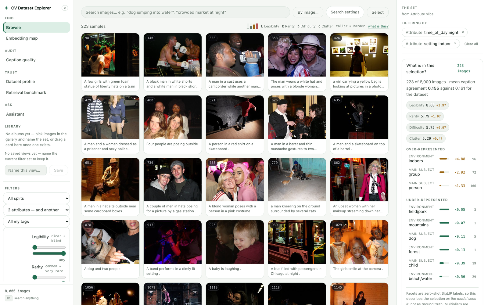

Facet filters come from zero-shot attribute classification over the existing
embeddings; the description panel summarizes any filtered set with counted,
never generated, statements.

### Judge difficulty, not just content

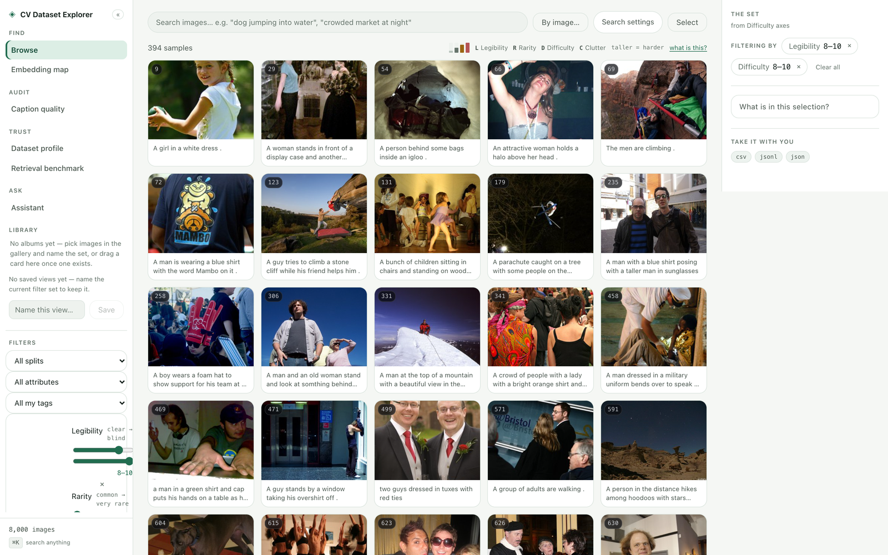

Four 0–10 axes — legibility, rarity, difficulty, clutter — computed as
percentile ranks over the corpus, each a filter, a badge and a sort key. "The
300 hardest validation samples" is a URL.

### See the corpus shape


The embedding map projects the corpus (UMAP, ingest-time); lasso a region to
tag or open it as a gallery slice. Isolated points are coverage-gap
candidates.

### Audit the annotations

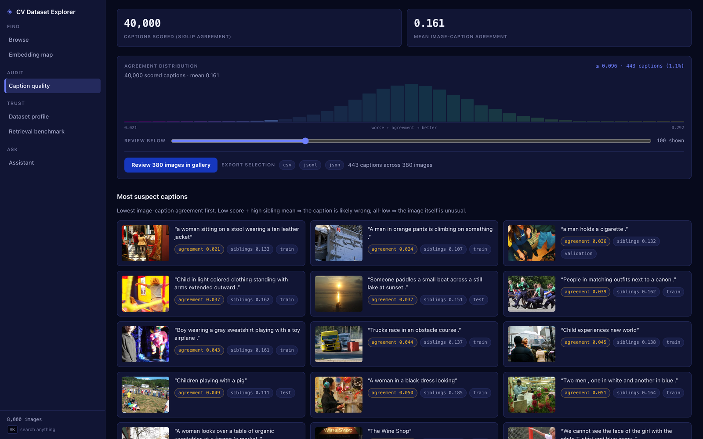

CLIPScore-style agreement between each caption and its own image, worst
first — likely annotation errors surface immediately. Per-sample caption
consistency flags images whose five captions disagree with each other.

### Trust, measured

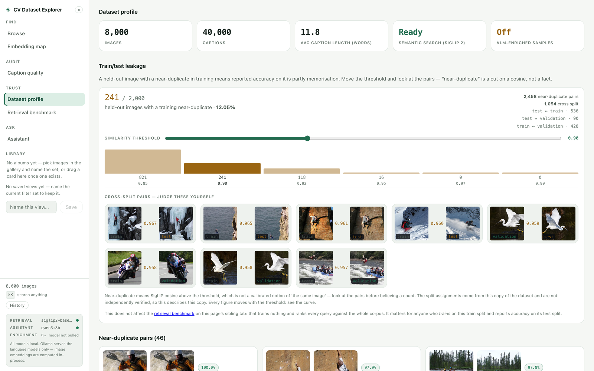
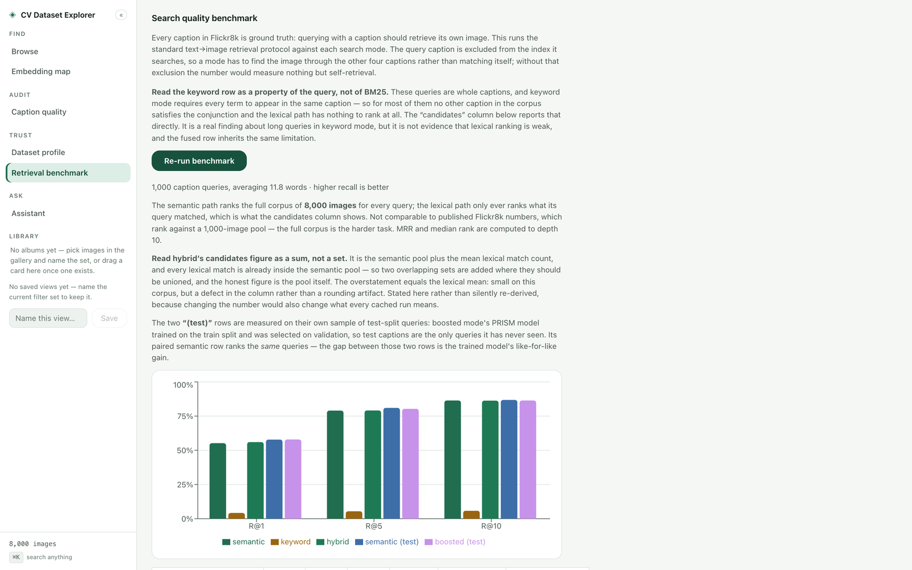

The stats page states the dataset's provenance and known defects. The
benchmark page measures the tool's own retrieval (text→image recall@1/5/10
per mode, the dataset's captions as ground truth) with its protocol and
caveats stated inline; `GET /api/stats/leakage` reports train/test
near-duplicate contamination as a threshold ladder rather than one arbitrary
number.

### Inspect one sample deeply

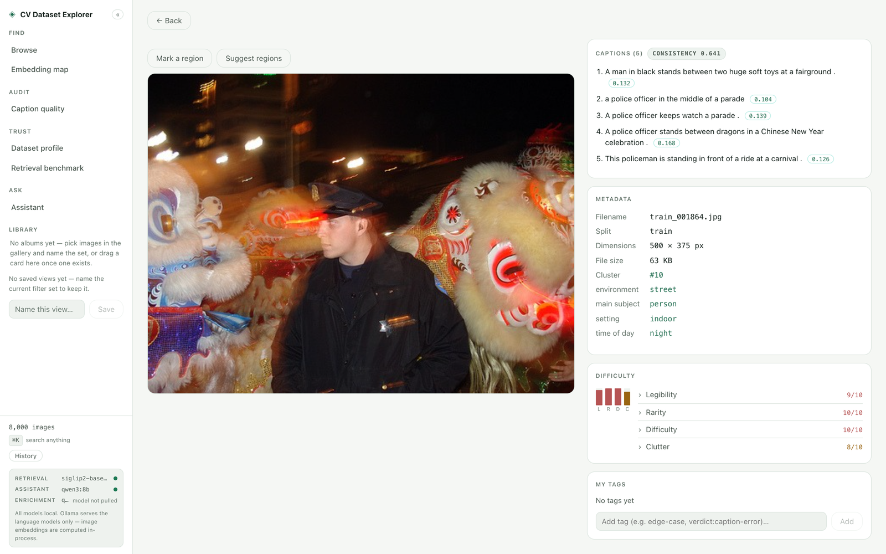
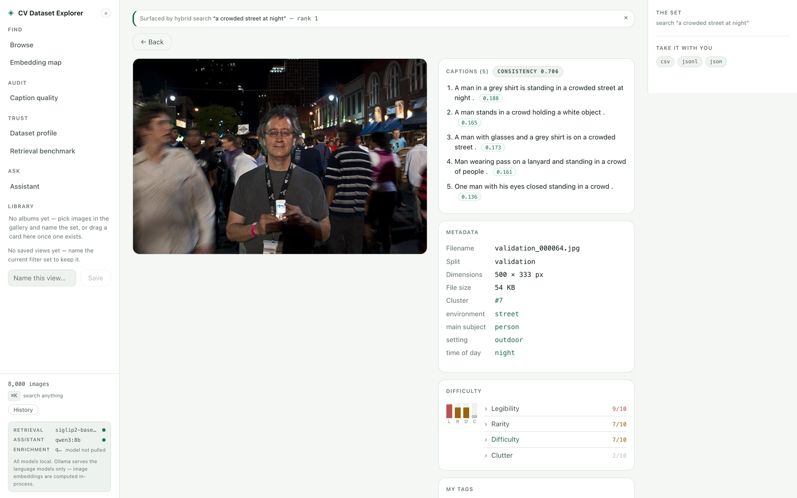
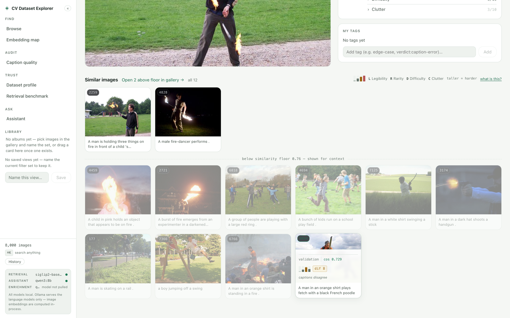

Every caption carries its agreement score. Neighbours below the corpus-derived
similarity floor (the measured 10th percentile of nearest-neighbour cosine in
the active index; `?min_sim=` overrides) grey out rather than posing as a
class — and when nothing clears it, the page says "possible coverage gap"
instead of padding. A sample reached from a search says *why* it surfaced.
Mark a rectangle on the image itself, add keep/remove points, or accept a
zero-shot Grounding DINO box proposal. SAM 2.1 turns that prompt into a visible,
refinable mask; the editor keeps the leaf class and explicit parent separate
(`dog` inside `animal`), and a human click accepts the mask as an annotation
with model, prompt and predicted-IoU provenance. Search can use that saved
object rather than the full source frame. Today the masked-object vector and
optional leaf-label vector rank the existing full-image index, and the result
header states that boundary rather than implying an object-patch index.
Rectangle search **toward or away from the region** remains available as the
fast fallback. `scripts/bench_detector.py` and `scripts/bench_sam2.py`
re-measure both optional models.

### Compare two frames

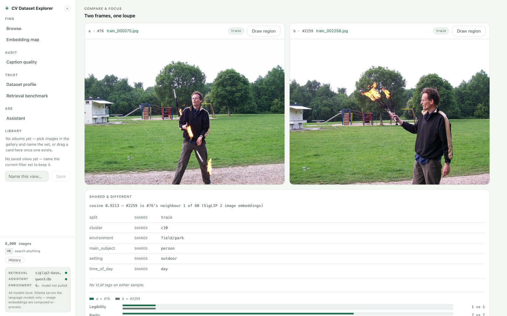

`/compare` puts two samples under one loupe — synchronized zoom and pan, a
counted shared/different panel, and manual rectangle regions (drawn by you, no
segmentation model) that can be saved as annotations or cropped into an
image search. Source images are never modified.

### Curate into albums, and let them leave

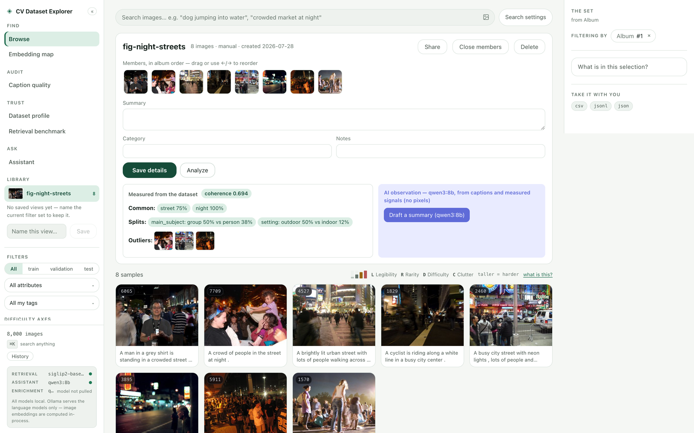
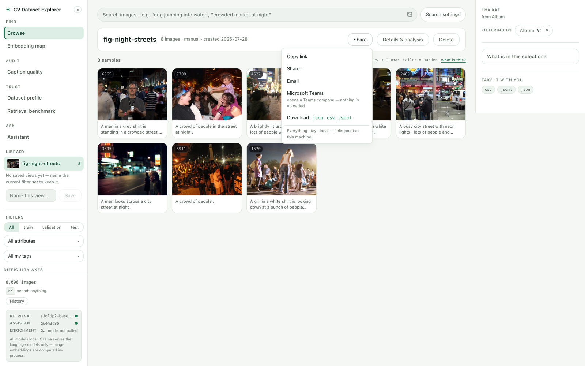

Albums are first-class ordered collections (provenance `manual` | `tag` —
converting a tag is explicit and keeps the tag). Pick images with the ✓ each
card carries — there is no mode to enter, so a click still opens the image —
or keep a whole ranking as an album straight from the result bar. Drag cards
onto the shelf —
every drop offers an Undo that removes exactly what the drop added — reorder
by drag or arrow keys, set a cover, edit the summary where you read it. The
Analyze panel counts what members share and where they split, and computes
coherence and outliers from the active index; a summary draft from the local
chat model is generated only on request, edited by you, saved only by you.
Share stays local-first: copy the URL, compose an email or Teams message
(nothing is uploaded), or download the slice as JSON/CSV/JSONL with a
manifest that records the query, model and embedding fingerprint that
produced it.

### Ask an assistant that shows its work

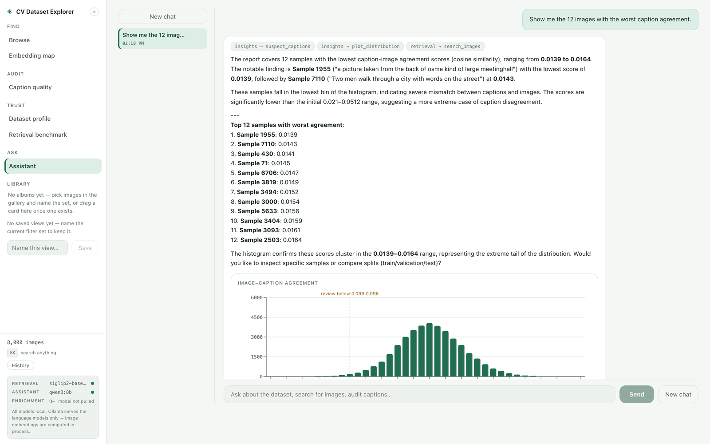

An optional LangGraph orchestration over local Ollama: an orchestrator routes
to retrieval/insights specialists, a synthesizer quality-gates the answer, and
**the graph's own node transitions stream into the UI as they happen** — the
progress you watch is the run, not an animation. Agents call the same service
functions as the REST API — retrieval stays deterministic — and can inspect
albums: ask about a rare-scenario album and the answer cites its measured
signals and outliers. The assistant's one mutation is a **proposal**: tagging
waits for your click, and conversations persist locally with
rename/reopen/delete.

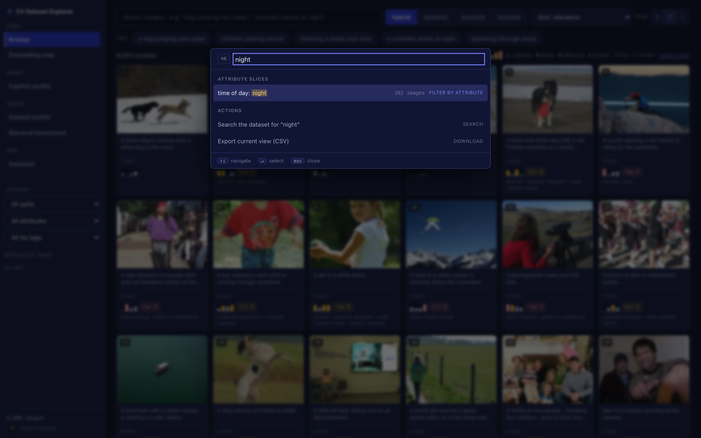
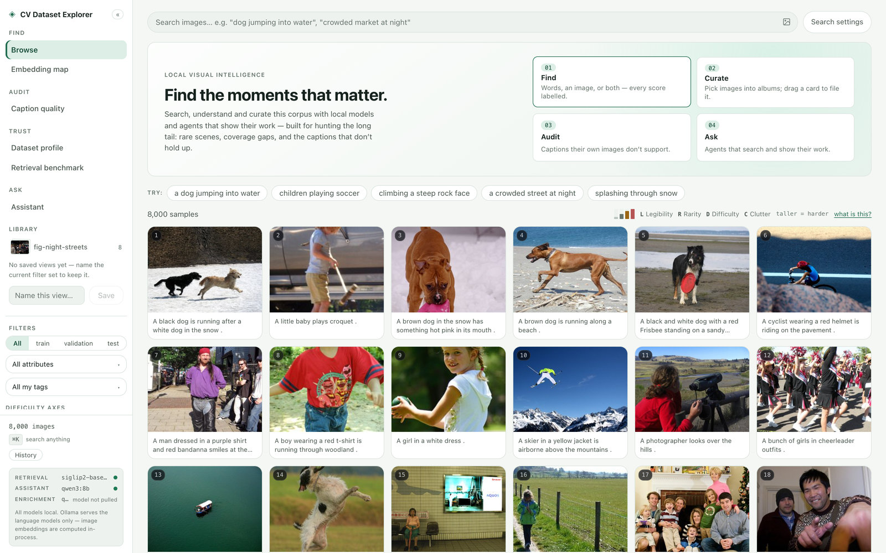

⌘K reaches everything; the rail's models card says which retrieval provider,
assistant and enrichment model are real, live and local right now — with the
named reason when one is missing.

### Let other agents in, read-only

A local [MCP server](docs/MCP.md) at `POST /mcp` exposes eight strictly
read-only tools, including saved-mask inspection and object-specific retrieval,
over the same service layer — any local MCP client, LangGraph included, can
investigate the corpus and cannot curate it.

## Architecture

One FastAPI process, one SQLite file (WAL), embeddings as `.npy`, images on
disk; a React 18 + TypeScript frontend whose search and filter state lives in
the URL (an investigation is a link). Heavy work happens in idempotent batch
CLIs (`ingest`, `analyze`, `enrich`); a request does SQLite lookups plus at
most one text-encoder forward pass. Retrieval is an exact NumPy cosine scan —
measured at ~0.2 ms against the 7–8 ms encode it waits behind, so at this size
an approximate index would trade recall to speed up the fastest stage of the
query. The seam is there rather than the machinery: `EmbeddingIndex.search`
takes a candidate mask, so an ANN index drops in behind the same signature for
text search — worth *benchmarking* around 100k vectors, with an
*estimated* crossover near 400k that is extrapolation, not permission: adoption
waits on a real FAISS recall-and-latency benchmark against the exact scan. A
hosted vector database is not
the answer to either (pgvector answers a different question — a multi-user
server deployment — and is discussed in
[ARCHITECTURE](docs/ARCHITECTURE.md)). Optional capabilities degrade with a
named reason, never a 500.

The deeper documents: [ARCHITECTURE](docs/ARCHITECTURE.md) (topology, seams,
scale path) · [TECHNICAL](docs/TECHNICAL.md) (schema, query plans,
measurements) · [DESIGN](docs/DESIGN.md) (decisions and trade-offs) ·
[TESTING](docs/TESTING.md) · [AGENTS](docs/AGENTS.md) ·
[CAPABILITIES](docs/CAPABILITIES.md) (generated; CI fails if it drifts) ·
[MCP](docs/MCP.md) · [DEPLOY](docs/DEPLOY.md) · [DEMO](docs/DEMO.md).

```
frontend/src/
  pages/          Gallery · Sample · Compare · Map · Stats · Quality · Benchmark · Assistant
  components/     rail, cards, album shelf/header, share menu, render blocks
  api/            typed client — every route the pages call through
backend/app/
  api/            19 routers over one service layer (run_search is the one ranking impl)
  ml/             providers (SigLIP 2 / Qwen3-VL) · exact index · detector · SAM2 segmenter
  agent/          LangGraph graph, tools, render-block contract
  qa/             flow registry + real-Chrome runner (one definition, three consumers)
  ingest/analyze/enrich    idempotent batch CLIs
docker/ + docker-compose.yml    the container path
scripts/        benchmarks, screenshots, capabilities/link checks
```

## Test evidence

```bash
cd backend && pytest                  # 383 passed (2026-07-29)
cd frontend && npx tsc --noEmit && npm run build
cd backend && python ../scripts/ui_smoke.py   # real-Chrome sweep, 17 workflows
```

The last full sweep at this commit: **108/108 checks across 17/17 workflows**
(run id in `backend/data/qa/`). Re-run rather than quote — the registry grows,
and every number above is only true of the day it was measured. CI runs the
light install (no torch/langgraph — those modules skip), ruff, tsc, the build,
the link check and the capabilities contract.

## Honest limitations

- Qwen3-VL underperforms SigLIP 2 on this benchmark (table above); the hubness
  constants were tuned in the SigLIP space and applied untuned in Qwen's —
  whether tuning closes any of the gap is unmeasured.
- The composed (reference-steered) ranking is unmeasured — the benchmark
  covers the text modes only; its blend weight is chosen, not tuned, and the
  code says so.
- The keyword benchmark row is *understated*, not flattered: the query caption's
  own row is excluded from the FTS scan (otherwise it would measure nothing but
  self-retrieval), and the strict AND conjunction then returns an empty
  candidate list for 85.3% of queries, so keyword R@10 reads 5.8% over a mean of
  2.1 candidates. Widening the conjunction raises that recall but lowers fused
  MRR overall (hybrid MRR 0.6313 → 0.5850), which is why it stays — the figures come from the
  benchmark's own cached run, and the page states the caveat where the number
  appears.
- The assistant needs Ollama and a ~5 GB model; step transitions stream live,
  but the reply text itself arrives whole at the end of the run.
- SAM 2.1 tiny runs here at 72 ms/mask warm (box-prompt p50; 73 ms by point
  prompt, 1.5 GB peak, 60 interleaved calls with no crash and 2 MB of drift).
  The retrieval benchmark is deliberately modest: background removal changed
  63% of the top-10 while a caption-word proxy moved only +0.009 over 16
  regions. Masks therefore ship for interaction, annotation and an explicit
  object-search mode—not as a claimed universal ranking improvement.
  `scripts/bench_sam2.py` records the full measurement.
- MCP is stateless JSON (no SSE streaming, no sessions); it binds to the same
  local server and adds no authentication — a local, single-user tool by the
  assignment's constraint.
- In-container inference is CPU-only and slower than the host path
  ([docs/DEPLOY.md](docs/DEPLOY.md) states expectations).
- The dataset copy itself is imperfect and the stats page says how (missing
  ~90 images vs the original distribution, undocumented split assignments, no
  upstream license).

## Configuration

Everything is environment variables; [.env.example](.env.example) lists each
one with its default and effect. The ones that matter first:
`CVDE_DATA_DIR`, `CVDE_EMBED_PROVIDER` (`siglip2` default | `qwen3_vl`),
`CVDE_EMBED_MODEL`, `CVDE_OLLAMA_URL`, `CVDE_CHAT_MODEL`, `CVDE_VLM_MODEL`.
