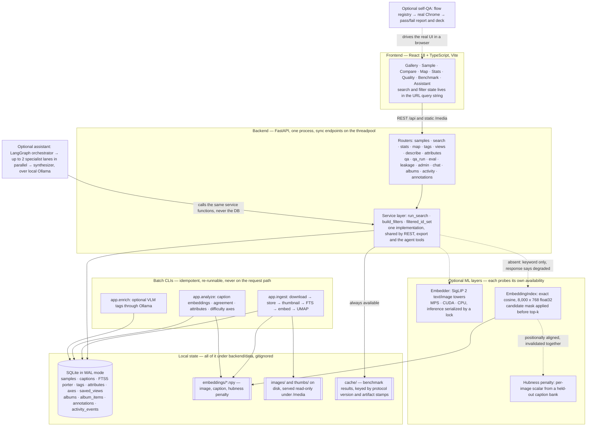

# Architecture

How the system is layered today, where its seams are, and what would replace
each piece at a scale this one does not have. [TECHNICAL.md](TECHNICAL.md) holds
the schema, the real query plans and the measurements; this document is the map
and the reasoning. [TESTING.md](TESTING.md) says which of these boundaries have
tests.

## Runtime topology

Solid edges are always present; dotted edges are the optional layers, and every
one of them has a defined behaviour when it is missing (below).

The workspace surfaces added in the 2026-07-28 wave — albums (ordered
collections with provenance), region annotations (rows over immutable images),
the activity log (rides the caller's transaction), composed retrieval with
scenario grouping, and the compare canvas — are all additive tables and routers
over the same service layer: no new processes, no schema migrations, and the
degradation rule below applies to each of them.

**Retrieval providers.** One active provider supplies both the query encoder
and the vector index: `siglip2` is the default because it measures better on
this corpus's own benchmark (R@1 55.2% vs 50.2%, ~5x the encode speed —
parameter count is not quality), and `qwen3_vl` (Qwen3-VL-Embedding-2B,
in-process through sentence-transformers — Ollama serves language models only
and cannot host it) is the explicit opt-in alternative behind the same seam.
Every step down the resolution chain carries a named reason that the status
API and the rail surface. Each
provider owns its index directory with a manifest (model id, measured
dimension, prompt version, similarity floor), so two embedding spaces can
never mix; fingerprints, saved-view provenance, the hubness penalty and the
benchmark cache are all provider-scoped. The UMAP map, clusters, caption
agreement and difficulty axes are computed in the SigLIP space at ingest time
and are deliberately not re-derived by a provider switch — they are stored,
SigLIP-derived signals and the docs say so.

## What the request path is allowed to do

A request does SQLite lookups plus, at most, one text-encoder forward pass.
Everything else -- embeddings, the UMAP projection, clusters, thumbnails,
agreement scores, attributes, difficulty axes -- is precomputed by
a batch CLI and read as an artifact.

Endpoints are deliberately sync `def`. FastAPI runs them on a threadpool and
NumPy and torch release the GIL, while an `async def` endpoint calling blocking
model inference would stall the event loop. The cost of that choice is that
inference must be serialized explicitly: two threads through one SigLIP module
on Metal either segfault or deadlock, so `Embedder` holds a lock per batch. At
real scale the honest fix is different -- embedding moves out of the API process
entirely, which is the first row of the seam map below.

## Exact search, and the point where it stops being right

Retrieval is a brute-force cosine scan in NumPy, with no approximate index.
The numbers that justify it, measured on an M-series Mac and recorded in
[TECHNICAL.md](TECHNICAL.md): the matrix is 8,000 x 768 float32 = 24.6 MB, a
full masked scan costs 0.18 ms, and the SigLIP text encode it waits behind costs
7-8 ms. The search is therefore roughly 2% of the query it belongs to, and an
ANN index would spend a dependency, a build step and some recall to speed up the
fastest stage of the pipeline.

The scan itself is measured at several sizes -- 0.16 ms at 8k, 1.7 ms at 100k,
4.1 ms at 250k, 18 ms at 1M vectors -- and **extrapolating** that line against
the encode puts the point where scanning costs as much as encoding at roughly
**400k vectors**. Treat 400k as an *estimated* crossover, not a threshold to act
on: it is arithmetic on a trend, measured on this machine's memory bandwidth,
and it says nothing at all about recall.

So the rule is: around **100k** the scan stops being a rounding error and the
question becomes worth *measuring*; before adopting any ANN index, run a real
benchmark of FAISS (`IndexIVFFlat` or HNSW) against the exact scan **on the
actual corpus**, reporting recall@k next to latency at the intended parameters.
Adoption is justified by that benchmark, never by this extrapolation and never
by the word "vector" -- an approximate index trades recall for speed, and the
trade has to be shown to be worth it on the data it will serve.

The substitution is local either way: `EmbeddingIndex.search` already takes an
`allowed_ids` candidate mask, so an ANN index drops in behind the same signature
without the API changing.

Two things this repo deliberately does NOT do, so the reasoning is on the record
rather than rediscovered:

* **No external vector database at this size.** At 8,000 images an exact NumPy
  cosine over a 24.6 MB matrix is both simpler and faster than a service, and
  the assignment constrains the whole system to one local machine. Adding Qdrant
  (or any hosted index) would buy nothing measurable here and cost a service, a
  schema and a second source of truth.
* **pgvector is the answer to a different question.** It becomes the right shape
  when the deployment turns *multi-user and server-side* -- several researchers
  sharing one corpus, needing concurrent writes, auth and backups -- because
  then the vectors want to live next to the relational data under one
  transactional store. That is a deployment change, not a speed optimisation,
  and it is not this submission.

## Degradation boundaries

The rule, stated once: a missing capability returns 200 with the degradation
named in the response. It never 500s, and it never produces a different number
under the same label.

| Layer | Probe | Behaviour when absent |
| --- | --- | --- |
| Opt-in retrieval provider (qwen3_vl) | provider probe: stack imports, cached weights, index manifest | falls back to SigLIP 2 with the named reason and the rerun command; the flat SigLIP index is never touched |
| Semantic and hybrid search | `get_index()` and `get_embedder()` | ranks by BM25 instead, sets `degraded`, `mode_used: keyword`, and a message naming the command to run |
| Composed search (`?like=`/`?unlike=`) | index + encoder presence | ranks the steering text by keyword instead, says so, and reports the references as ignored |
| Embedding map, duplicates, similar images | index presence | the view states what to run |
| Caption QA, attributes, difficulty axes | analysis columns | the view states what to run |
| Retrieval benchmark | image + caption indexes | `available: false` with the command; with no embedder it falls back to stored caption vectors and says the rows understate the shipped path |
| Assistant | agent imports + an Ollama probe | `GET /api/chat/status` reports `available: false`; `POST /api/chat` returns 503 with setup instructions |
| Self-QA sweep | `playwright` import | `POST /api/qa/run` returns 503 with setup instructions |
| QA slide deck | `python-pptx` import | the Markdown report is still written and says the deck was skipped |
| VLM tags | Ollama + a vision model | the tags are simply absent; nothing else changes |

## How model and index consistency is protected

Every artifact in `embeddings/` is only meaningful next to the model that
produced it, so each consumer validates rather than assumes.

- Vectors are L2-normalised at write time, so cosine similarity *is* the dot
  product and no query-time normalisation can be forgotten.
- The hubness penalty is positionally aligned to the image index, so it cannot
  outlive it: `invalidate_index()` invalidates the penalty in the same call, and
  `EmbeddingIndex.search` raises if a penalty vector does not match the score
  vector it would be subtracted from.
- The benchmark cache key carries the protocol version, the query sample size,
  `RRF_K`, `SEARCH_DEPTH`, the hubness constants and
  the mtimes of the embeddings and the database -- so a cached row computed under
  a different definition can never be served as if it were current.
- `CVDE_EMBED_MODEL` must be identical for indexing and for serving, because the
  server encodes queries live. [../scripts/swap_backbone_so400m.sh](../scripts/swap_backbone_so400m.sh)
  exists to do that consistently, and the guards above turn a mistake into a
  fallback rather than a silently wrong ranking.

## How train, validation and test stay apart

The split is a column on `samples`, and three separate things depend on keeping
it honest.

- **The hubness bank** is drawn from captions, and those caption ids are removed
  from the benchmark sample, so no query is one of the captions that built the
  correction being measured.
- **The benchmark** excludes each query caption from the lexical index it
  searches. Without that, keyword R@1 measured 99.1% -- pure self-retrieval. The
  image's other four captions stay indexed: that is the published protocol, not
  a leak.

Contamination that predates all of this is reported rather than assumed away:
`GET /api/stats/leakage` returns held-out images with a near-duplicate in
training as a ladder over cosine thresholds, because the answer moves violently
with the cut and a single headline figure would be an arbitrary choice dressed as
a measurement.

## How filters and ranking compose

One invariant carries most of the correctness weight: **filters are applied
inside each ranking, never after a LIMIT.**

1. `build_filters` composes one parameterised `WHERE` from split, tag, VLM tag,
   repeated attribute facets, four axis ranges, a pasted id list and an
   agreement threshold. Column names are whitelisted identifiers; every value is
   a bound parameter.
2. `filtered_id_set` runs that clause once and returns the candidate mask the
   semantic path passes to `EmbeddingIndex.search`.
3. The keyword path splices the same clause into its FTS5 query as `AND`, before
   `LIMIT`.
4. Both rankings are taken to exactly `SEARCH_DEPTH` (300) and fused once by
   reciprocal rank -- ranks, not scores, because a SigLIP cosine and a BM25 score
   are not comparable. The depth is a hard horizon, so paging slices a window out
   of one ranking rather than recomputing a deeper one per page.
5. An optional axis sort re-orders the whole retrieved set in SQL, and the
   response says so, because that replaces relevance order rather than refining
   it.
6. Each card carries the path that retrieved it and its absolute rank, and the
   response names the basis of its score: `cosine`, `cosine_adj` when the hubness
   penalty re-ranked, `rrf` for a fused rank.
   These live on different scales and must never be read against each other.

`/api/export` reuses `run_search`, so an exported slice is exactly the result set
the user was looking at, in the same order, with the query and the embedding
model recorded in its manifest.

## Where generated state lives

Everything below is created locally and gitignored; the repository carries no
images, database, embeddings or model weights.

| Path | Written by | Read by |
| --- | --- | --- |
| `backend/data/explorer.db` | `app.ingest`, `app.analyze`, tag and view writes | every request |
| `backend/data/images/`, `thumbs/` | `app.ingest` | `/media` static mounts |
| `backend/data/embeddings/*.npy` | `app.ingest`, `app.analyze`, `app.ml.hubness` | `EmbeddingIndex`, hubness |
| `backend/data/cache/` | the benchmark and the hubness build | the benchmark, keyed as above |
| `backend/data/qa/<run_id>/` | the self-QA sweep | `/media/qa` and `/api/qa/artifact` |
| `backend/data/reports/` | assistant report generation | `/api/reports/{name}` |

`POST /api/admin/reload` re-reads the indexes in place, which is how a finished
batch job becomes visible without restarting the API.

## Production scale path

The closest public reference architecture for this problem is NVIDIA's
[Cosmos Dataset Search blueprint](https://github.com/NVIDIA-Omniverse-blueprints/cosmos-dataset-search)
(ingestion → GPU embedding service → Milvus vectors + Postgres metadata →
API/UI over object storage). This project is intentionally that shape in
miniature.

### Seam map

| Local component | Production component |
| --- | --- |
| `datasets/` adapter | Ingestion service consuming uploads from a message queue |
| `Embedder` (in-process) | GPU inference service (Triton/NIM, dynamic batching) |
| `EmbeddingIndex` (numpy) | Vector DB shards (Milvus/Qdrant), build/serve separated |
| SQLite metadata | Postgres + lakehouse tables (Parquet/Iceberg/Lance) |
| `ingest.py` / `analyze.py` | Orchestrated batch DAGs (Airflow/Dagster) over the lake |
| `POST /api/admin/reload` | Index versioning + blue/green index swap with validation |
| Benchmark tab (recall@k) | Continuous retrieval-quality SLO on golden query sets |
| Export manifest | Versioned dataset slices with lineage (query → slice → run) |
| LangGraph assistant | Agentic analysis layer calling the deterministic search API |

### What breaks first, and the fix at each stage

**~100k images.** Exact search is still ~ms; what breaks first is request-path
embedding and in-process index reload. Fix: dedicated GPU embedding service with
dynamic batching; an ANN index (HNSW); atomic blue/green index swap behind the
existing reload seam.

**~10M.** Single-node memory and index rebuild time break. Fix: vector DB with
disaggregated build/serve nodes, quantization (PQ/int8); metadata to Postgres;
embeddings to object storage (Lance/Parquet); analysis becomes orchestrated DAGs;
recall@k and latency become monitored SLOs; embedding-drift monitoring
(distribution shift against a reference set) joins the dashboard.

**~1B+ (fleet scale, hundreds of PB).** RAM-resident indexes stop making
economic sense. Fix: disk/object-storage-based sharded indexes (DiskANN-style,
tiered storage), embeddings at multiple granularities (clip / frame / object),
aggressive metadata pre-filtering to shrink the candidate space before vector
search, result caching, and first-class data versioning so any curated slice is a
reproducible training set. At this scale the product is no longer "search" but a
curation platform with lineage.

### Where the agents sit

At every scale, LLM and VLM agents (hypothesis generation, semantic query
expansion, failure triage) remain a *client* of the deterministic retrieval API,
never inside it. Retrieval stays testable, reproducible and benchmarkable; agents
add reasoning on top. That separation is this repository's assistant design, and
it is also how production "AI data analyst" layers are built over search
infrastructure.

### References

NVIDIA Cosmos Dataset Search ([repo](https://github.com/NVIDIA-Omniverse-blueprints/cosmos-dataset-search),
[docs](https://docs.nvidia.com/cosmos/cds/latest/introduction.html)) ·
[Milvus architecture](https://milvus.io/blog/deep-dive-1-milvus-architecture-overview.md) ·
[Lance format](https://github.com/lance-format/lance) ·
[Triton serving](https://docs.nvidia.com/deeplearning/triton-inference-server/user-guide/docs/user_guide/architecture.html) ·
[Hybrid search + rerank](https://qdrant.tech/documentation/advanced-tutorials/reranking-hybrid-search/) ·
[Embedding drift monitoring](https://www.evidentlyai.com/blog/embedding-drift-detection)
