# Visual workflow guide

[← Back to the README](../README.md)

This guide covers every top-level route and the cross-page workflows that turn a search into a reviewed, shareable research set. Follow [Run locally](../README.md#run-locally) first so the Flickr8k ingest, API, and frontend are available.

The screenshots come from a verified local run over 8,000 images and 40,000 captions. Vision inspection, semantic pair comparison, detection, segmentation, and the assistant depend on the [optional local models](../README.md#optional-local-models). When one is unavailable, the interface keeps the core workflow usable and explains what is missing.

VLM captions and semantic comparisons remain read-only. Proposed classes and detector boxes can seed a mask draft; only the reviewed annotation is persisted through **Accept & save**. A generated album summary is persisted only when it is explicitly saved.

This is a local, unauthenticated, single-user application. Do not expose its API directly to a network.

## Flows at a glance

| # | Workflow | Start | Durable change? |
| --- | --- | --- | --- |
| 1 | Find, navigate, and resume | Any page | Only when saving or deleting a saved view |
| 2 | Browse, search, filter, rank, and export | `/` | Settled searches add local History; saved views are explicit |
| 3 | Search by image, example, exclusion, or region | `/`, a sample, or Compare | Adds local History; image bytes and crops stay transient |
| 4 | Characterize and group a result set | `/` | Only when saving a proposed group as an album |
| 5 | Explore embedding space | `/map` | Only when bulk-tagging the working set |
| 6 | Triage caption quality | `/quality` | Only when recording a reviewer verdict or tag |
| 7 | Inspect one sample | `/samples/:id` | Only through tag or annotation controls |
| 8 | Run structured vision inspection | `/samples/:id` | No; inference is read-only |
| 9 | Detect, segment, review, and save | `/samples/:id` | Only after **Accept & save** |
| 10 | Compare two frames and ground a difference | `/compare?a=<id>&b=<id>` | No; grounding opens an unsaved sample draft |
| 11 | Audit the dataset profile | `/stats` | No; the entire route is read-only |
| 12 | Run the retrieval benchmark | `/eval` | Writes a local backend cache and mirrors the browser session; dataset records do not change |
| 13 | Curate, analyze, share, and export an album | `/` or `/?album=<id>` | Album membership, order, details, and saved summaries |
| 14 | Ask the local assistant and approve proposals | `/chat` | Stores a browser-local transcript; tags require approval |

## 1. Find, navigate, and resume work

**Goal:** reach a page, sample, tag, attribute, saved view, or action without losing the current investigation.

1. Open the left rail, or press **Cmd/Ctrl+K** from any page.
2. Type a page name, sample ID, tag, attribute, saved view, or search phrase.
3. Use the arrow keys and Enter, or click the matching destination or action.
4. Use **History** to reopen a prior search or album investigation.

Navigation and restoration are read-only. Saved-view creation and deletion live in the left rail and write bookmark metadata to the local SQLite database.

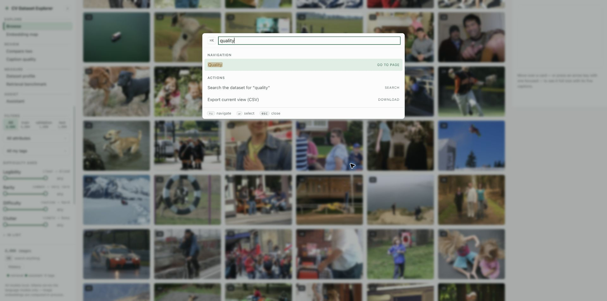

## 2. Browse, search, filter, rank, and export

**Goal:** isolate a long-tail slice and understand why every frame appears in the ranking.

1. Enter a query and choose keyword, semantic, or hybrid search.
2. Narrow the corpus by split, attribute, tag, difficulty range, or an ID/filename list.
3. Choose relevance or a difficulty axis for ordering, then set the tile density.
4. Read the named score basis, score distribution, difficulty edge, and per-card provenance.
5. Open a sample, load more results, save the view, or export the exact current slice.

Filters intersect before ranking and live in the URL, so the slice is shareable. The difficulty edge and **dim below** handle are visual lenses: they do not filter, reorder, or change exports. A settled text or composed search appends an activity row to local History.

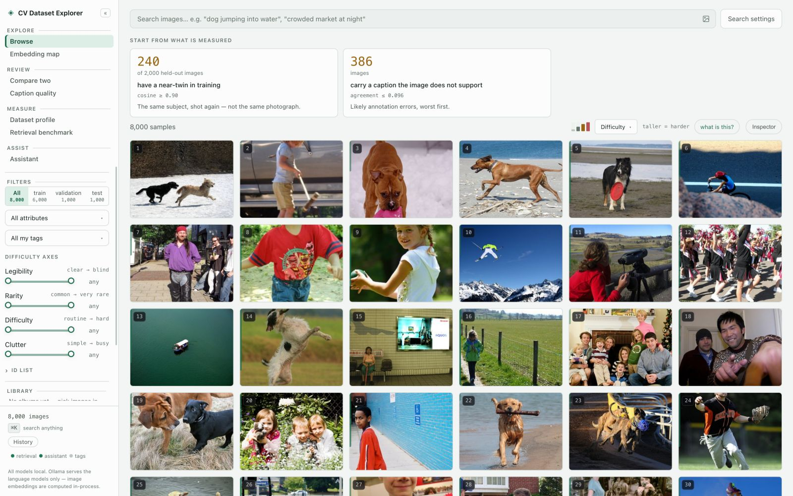

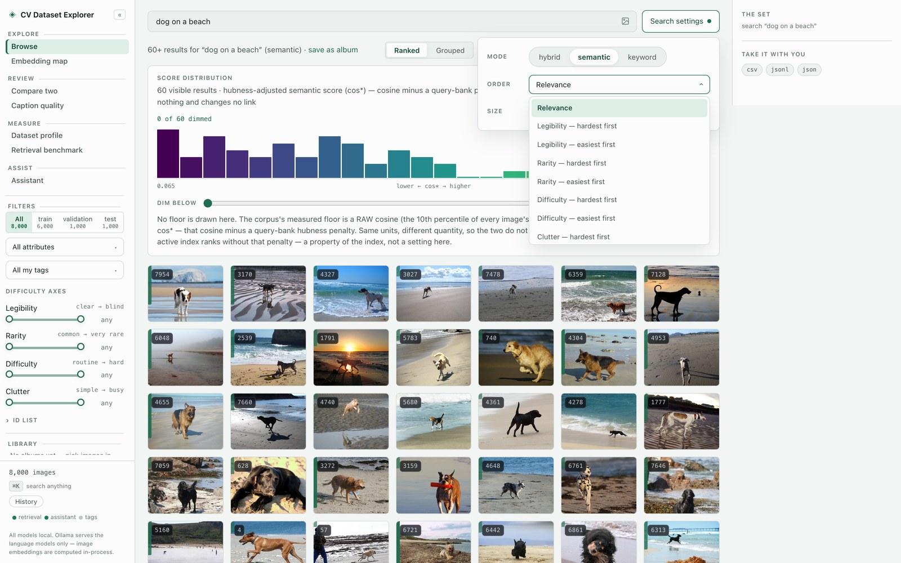

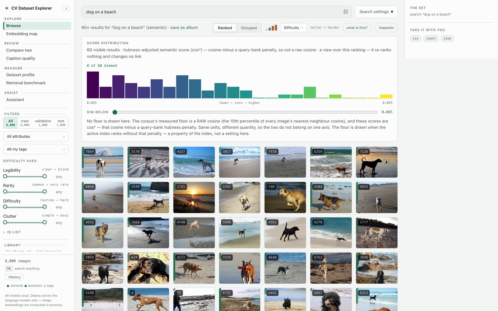

## 3. Search by image, example, exclusion, or drawn region

**Goal:** retrieve visual concepts that are awkward to express with text alone.

1. Upload, drop, or paste an image into the gallery; or start from a corpus sample.
2. Choose **More like this** for a positive reference or exclude a reference to push that concept away.
3. On a sample or Compare pane, draw a region and optionally add steering text.
4. Inspect the cosine or composed-reference ranking, adjust references, and open the result as a shareable ID-list slice.

Image search records its source name and result count in local History, but uploaded bytes and drawn crops are temporary search inputs. Corpus reference IDs can live in the URL. A crop does not become an annotation unless it separately passes the review and acceptance workflow.

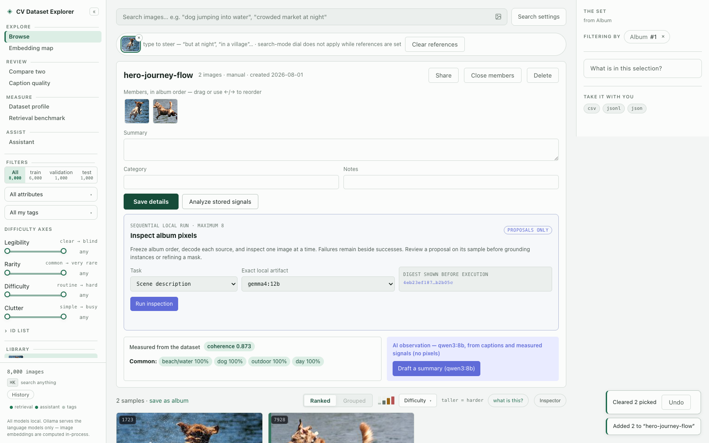

## 4. Characterize and group a selected result set

**Goal:** explain what distinguishes a slice and turn useful subgroups into reusable research sets.

1. Create a search or filtered result set.
2. Open **What is in this selection?** and inspect over- and under-represented facets with their raw counts.
3. Drill into a facet, or switch to the grouped view to inspect proposed subgroups.
4. Open a subgroup in the gallery or save it as an ordered album.

Facets and groups are zero-shot hypotheses, not ground truth. Grouping stays transient until **Save as album** is chosen.

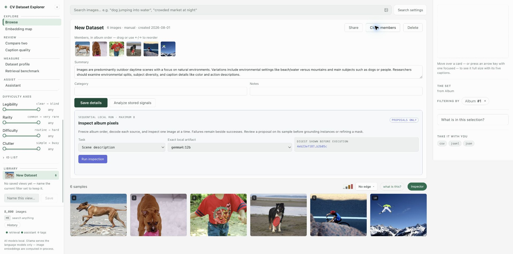

## 5. Explore embedding space and build a working set

**Goal:** find clusters, isolated samples, duplicate neighbourhoods, or an arbitrary spatial region.

1. Open **Embedding map** and choose the point-colour basis.
2. Pan, zoom, and hover to inspect local neighbourhoods.
3. Switch to Select, or Shift-drag a lasso, to create a working set.
4. Drop or restore thumbnails, scope the map to the set, tag it, or open it in the gallery.

Projection distance is exploratory and can be distorted. The lasso and working set remain temporary until scoped into a URL or handed to the gallery; **Tag selection** is the map's direct bulk write, and the gallery can then add the set to an album.

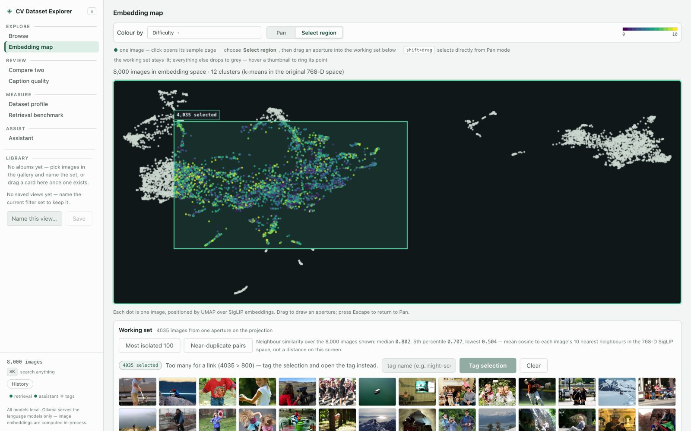

## 6. Triage caption quality and record a verdict

**Goal:** find captions that are weakly supported by their image or samples whose five captions disagree.

1. Open **Caption quality** and move the review threshold.
2. Switch between suspect-caption and least-consistent rankings.
3. Open a row for pixel-level review, or send the thresholded slice to the gallery.
4. Record a reviewer verdict or tag, then export the reviewed slice if needed.

Agreement scores and the threshold are measurements, not truth. Moving the threshold is read-only; verdict and tag controls perform a write only after the server accepts the change.

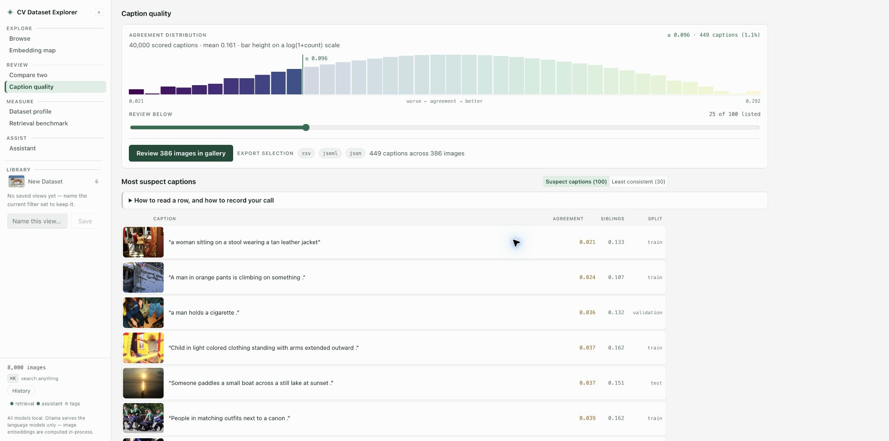

## 7. Inspect one sample

**Goal:** review the pixels and all stored evidence for one image before taking action.

1. Open a result card to view the source image and search provenance.
2. Read all five captions, metadata, split, cluster, attributes, and difficulty axes.
3. Inspect nearest neighbours above and below the measured similarity floor.
4. Move with Previous/Next or the keyboard, and add or remove a reviewer tag only when needed.

Inspection is read-only except for visible tag and annotation controls. Neighbours below the floor provide context; they are not asserted matches.

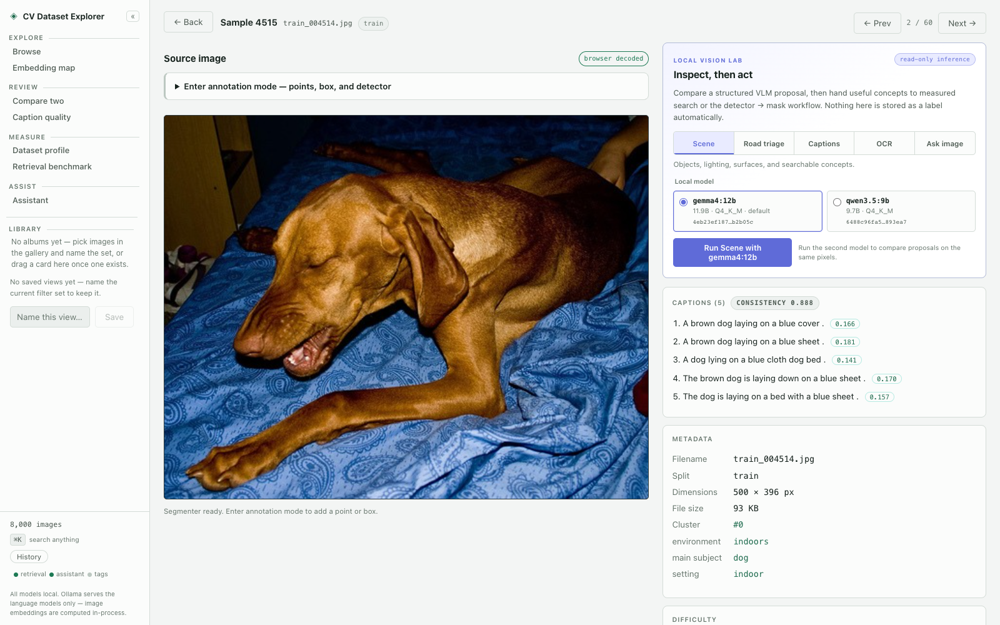

## 8. Run local structured vision inspection

**Goal:** ask a local vision model for a structured scene, road-triage, caption, OCR, or focused-question proposal.

1. On a sample, choose the inspection task and a ready local model.
2. Run the inspection and read the structured proposal and its provenance, including model and input hashes, artifact details, latency, and prompt/schema versions.
3. Compare a second model when useful.
4. Search a proposed concept, hand it to the detector, or download the proposal as JSON.

This panel is explicitly read-only inference. Nothing it proposes is stored as a label automatically.

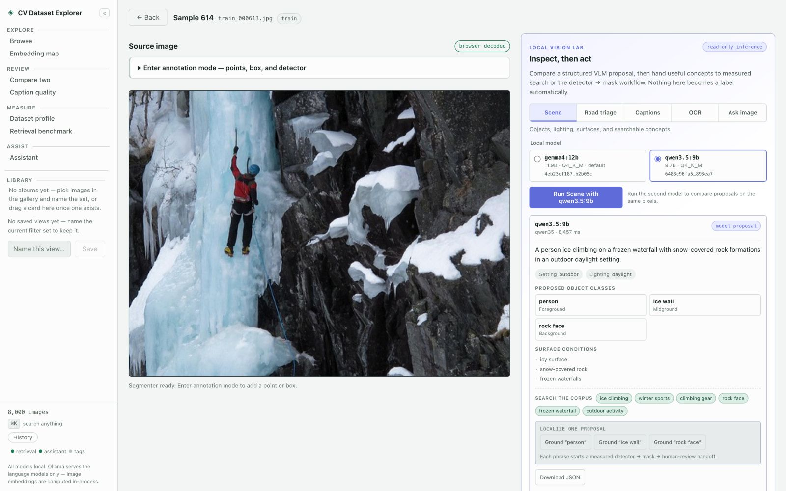

## 9. Detect, segment, review, save, search, and export

**Goal:** turn a grounded phrase or manual prompt into a reviewed SAM 2.1 mask and reusable artifact.

1. Enter annotation mode on a sample.
2. Leave the phrase blank for the visible fixed vocabulary, enter targeted phrases, or place keep/remove points or a box manually.
3. Select a detector proposal and correct the mask with additional prompts.
4. Name the class and optional parent, then inspect predicted IoU, image area, detector source, and geometry.
5. Choose **Accept & save** only after review. A saved annotation can then seed search, export a transparent cutout/evidence package, or be deleted with confirmation.

Detector boxes and SAM masks are drafts. No matching box stops before SAM; an unavailable detector leaves manual tools; an unavailable SAM leaves an unsavable box-only draft.

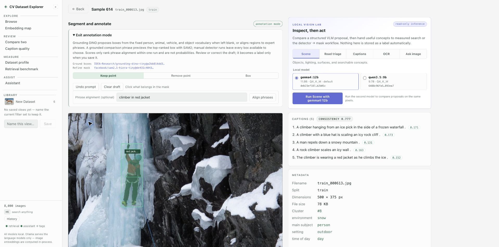

## 10. Compare two frames and ground a difference

**Goal:** inspect an ordered A→B pair under synchronized zoom and pass a useful difference into the annotation review flow.

1. Pick exactly two images, or fill the A and B panes directly.
2. Pan and zoom either pane; both views stay synchronized.
3. Review shared and differing stored signals, attributes, difficulty axes, cosine similarity, and the A-to-B neighbour rank.
4. Optionally run semantic comparison after both source images decode.
5. Verify the proposed differences against both frames, then choose a grounding phrase for image A or B.
6. Review the detector-to-mask draft on that exact sample; save only from the sample page.

Pair order matters. Accepted annotation overlays are read-only on Compare, drawn regions are temporary search inputs, and semantic differences remain proposals. Grounding opens a detector-to-mask draft and does not bypass annotation acceptance.

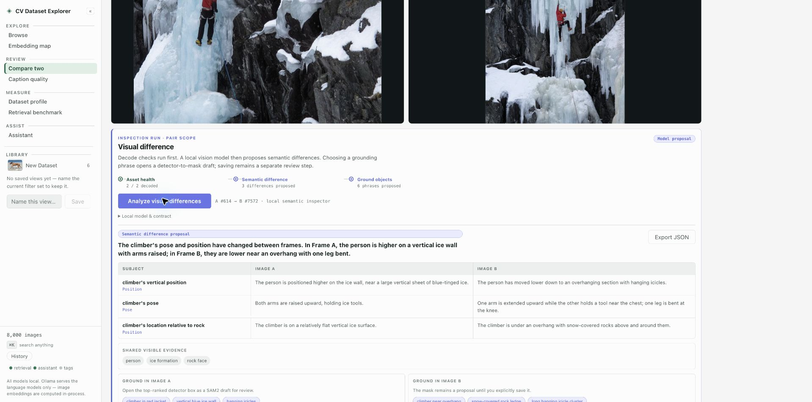

## 11. Audit the dataset profile

**Goal:** answer five addressable questions about corpus size, split trust, prompt-slice coverage, caption health, and provenance.

1. Read **Overview** for live image, caption, split, size, and capability counts.
2. Open **Split integrity**, vary the near-duplicate threshold, and inspect candidate pairs.
3. Open **Prompt slices** and drill a coverage bar into the gallery.
4. Review **Caption health** distributions.
5. Read **Provenance** for the pinned source, missing rows, bias, licensing, and known limitations.

The entire route is read-only. Near-duplicate status depends on an uncalibrated threshold, and prompt slices are zero-shot hypotheses rather than ground-truth categories.

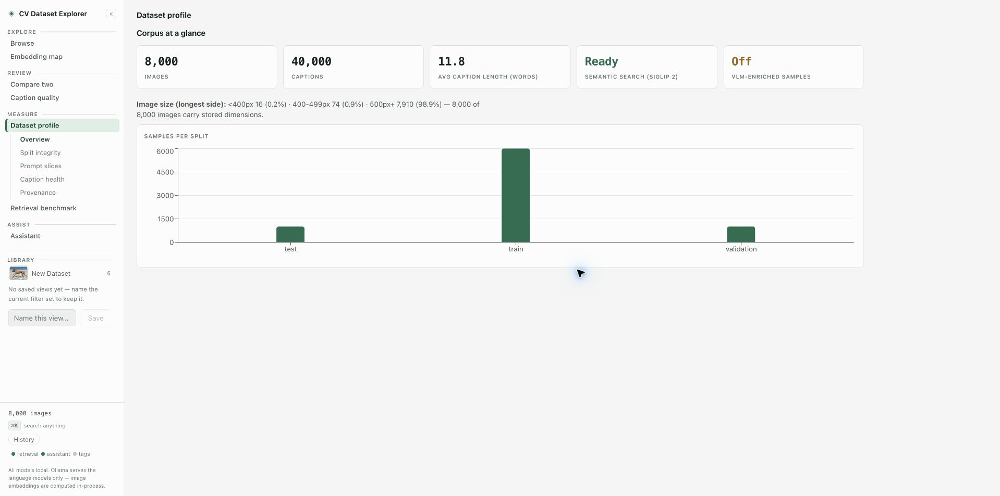

## 12. Run the retrieval benchmark

**Goal:** compare keyword, semantic, and hybrid text-to-image retrieval on the local Flickr8k ingest.

1. Open **Retrieval benchmark** and run or re-run the evaluation.
2. Compare R@1, R@5, R@10, MRR, median rank, and candidate counts.
3. Read the protocol and fallback notes before comparing modes or external figures.

The benchmark computes the result, writes a JSON cache under the configured cache directory, and mirrors the last response in the browser session; it does not mutate dataset records. Full-corpus retrieval is harder than published figures that rank against a 1,000-image candidate pool, so those numbers are not directly comparable.

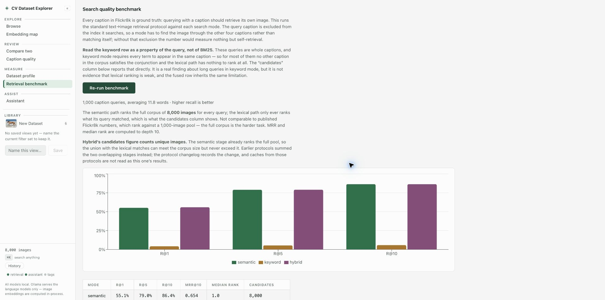

## 13. Curate, analyze, share, and export an ordered album

**Goal:** turn transient picks or a proposed group into a durable research set.

1. Pick images in the gallery and create or open an album.
2. Reorder members, remove items, set the cover, and edit category or notes.
3. Analyze stored signals or inspect album pixels with an optional local model.
4. Review any generated summary before explicitly saving it.
5. Copy the local share link or download CSV, JSONL, or JSON.

Creation, membership, order, details, cover, summary save, removal, and deletion are writes. Album deletion requires confirmation. Share links point back to the local application; exports create copies without changing the dataset.

## 14. Ask the local assistant and approve proposals

**Goal:** route a research question to local specialists and receive traceable tables, charts, images, reports, or QA status.

1. Start or reopen a conversation and ask a question or choose a prompt.
2. Watch the live execution trace and inspect the returned artifacts.
3. Sort, hover, and drill interactive blocks into gallery slices.
4. Review tag proposals per sample; approve only the intended IDs or reject the proposal.
5. Stop, retry, rename, or delete the local conversation as needed.

The assistant is optional and experimental. Conversations persist in browser local storage. A proposal performs no write until the browser approves the selected IDs; Reject sends no write request. Verify quantitative conclusions against the underlying sources.

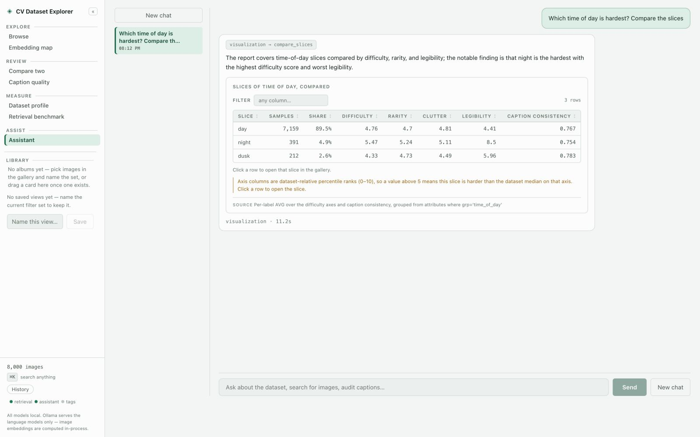

## Write boundaries and failure behavior

| State or action | What happens |
| --- | --- |
| Filters, sorting, score dimming, quality thresholds, map lasso, profile views | Read-only view state |
| Settled text, composed-reference, or image search | Appends an activity row to local History; uploaded bytes and crops are not stored |
| Retrieval benchmark | Writes a configured local JSON cache and a browser-session copy; dataset records do not change |
| Saved views, tags, album membership/order/details | Explicit local metadata write |
| VLM captions and semantic comparison | Read-only proposal with no direct save path |
| Proposed class, detector box, or SAM mask | Can seed a draft; only **Accept & save** on a reviewed annotation persists it |
| Generated album summary | Draft until its own save action |
| Assistant conversations | Stored in browser local storage; dataset records do not change |
| Assistant tag approval | Writes only the individually selected sample IDs |
| CSV, JSONL, JSON, cutout, or evidence export | Downloads a copy; source dataset records do not change |

If an optional model is missing, the related panel shows its setup state instead of failing the rest of the application. If detection returns no box, SAM is not called. If SAM is unavailable, the detector result remains visible but cannot be saved as a mask. If a write request fails or the connection drops, reload the relevant view before retrying so the interface can reconcile with persisted state; do not assume the write either committed or rolled back.
